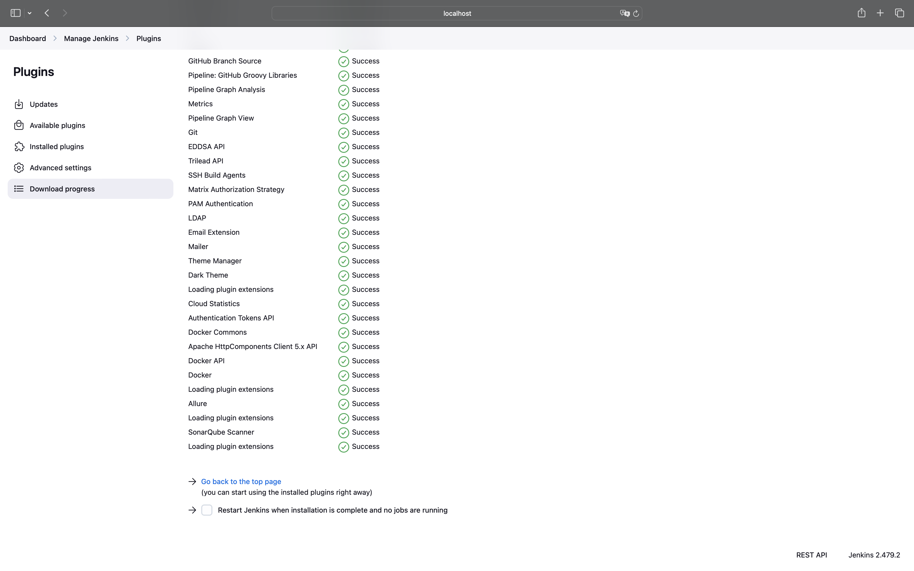

## Домашнее задание №4 

### **Тема:** Jenkins

---

### **Постановка задачи:**
```
Взять приложение из п.3 (или любое другое), автоматизировать его сборку в Jenkins (pipeline и freestyle Job) на событие pull-request/push.
В pipeline должны входить:
- сборка приложения (maven, другой сборщик)
- запуск автотестов (unit в зависимости от проекта, postman)
- сборка результатов работы тестов в allure и отброска в Jenkins
- анализ исходного кода Sonar (в том числе необходимо исправить все ошибки и (добиться не менее 90% покрытия кода тестами)* зависит от проекта)
- деплой приложения через Ansible (из лаб №2) или сборка контейнера (т.е. отказ от ансибл)
```

---

### **Описание решения / подтверждения:**


Начинаем работу с запуска `docker-compose up -d`

Мы получаем запущенные на `http://localhost:8080/` и `http://localhost:9000/` соответственно `Jenkins` и `SonarQube`

После чего приступаем к их настройке (произведенные настройки в конце - в блоке `Подробнее про настройки`)


#### Полученные результаты allure:
(все тесты пройдены)


#### Полученные результаты sonar:
(необходимые 90% достигнуты)


#### Основной экран выглядит так:


#### Автоматизация сборки через webhooks:


P.s. для настройки использовал ngrok (`ngrok http 8080`)


#### Docker registry:


#### Итоги:

- Автоматизированная сборка в Jenkins по событию
- Сборка с использованием maven
- Запуск тестов
- Получение и сохранение результатов allure
- Анализ и результаты sonar
- Сборка и отправка в docker registry

---

### **Подробнее про настройки:**

#### Устанавливаем необходимый плагины в Jenkins (Allure, Sonarqube, Docker)


#### В tools настраиваем конкретные версии:


#### В System прописываем нужные конфигурации:


P.s. обращаем внимание на то, что доступ будет из контейнера производиться, поэтому указываем для SonarQube ip из ifconfig

#### Настраиваем токен в SonarQube:
(Тот, который должны вписать в credentials Jenkins (далее))


#### Настраиваем credentials в Jenkins:
(Добавляем сюда тот самый токен из SonarQube - `'Java-token'` и данные для входа в docker registry - `docker-credentials-id`)


#### Далее создаем новый проект - pipeline
(Это собственно та самая джоба, которую планируем запускать)

Настраиваем возможность использовать некоторые события для автоматического запуска (webhooks)


Последняя и самая важная настрока - указываем ссылку на github, где лежат файлы проекта, указываем ветку и Jenkinsfile


На этом настройки завершены, результаты работы - выше